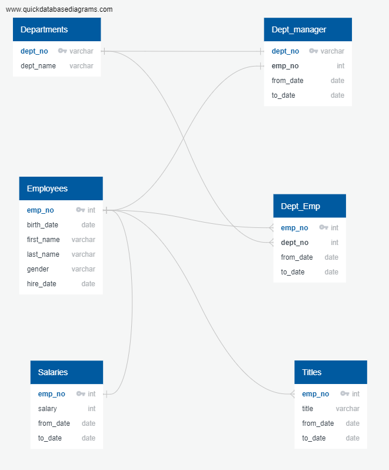

# Pewlett-Hackard-Analysis

UTDA Module 07

## Challenge Work

### Technical Report

The scope of this project was to create an employee database for Pewlett-Hackard in order to identify the current employees that are near retirement age as well as identify potential mentors at the company who work with less experienced employees in order for the company to run smoothly as employees retire.  

In order to accomplish these goals I created a database that contained 6 tables (Employees, Departments, Department Employees, Department Managers, Titles and Salaries).  The picture below shows the tables and how they are related.  In order to create the first deliverable, a list showing the number of employees retiring by title, a table was created that shows employee number, name, title, from date, to date and salary for all employees that were born from 1952 to 1955 (this table has been exported to retiringbytitle.csv).  Unfortunately this table contains duplicates, so it had to be partitioned to show only the most recent title.  A new table was created and exported to "Deliverable 1C-retiringbytitle-no dups.csv", by partitioning the table to only show the employee's most current title by using the "to_date" column from the original table.  Once the table with no duplicates was created I used a the SELECT function with the COUNT and DISTINCT function to create a table that has been exported to "Deliverable 1A - titlecount.csv" to give a count of how many different titles that people have that will retire soon.  The final step was to create a table that was exported to "Deliverable 1B - titleSummary.csv" that shows the count of retiring employees by title.  After the work on Deliverable 1 was completed I worked on the second deliverable, a list showing potential mentors.  This table was created with employee number, name, title, from date and to date for all current employees that were born in 1965 (exported to mentorlist.csv).  Similar to the first list created for Deliverable 1 this list has duplicates in it and had to be partitioned using the "to_date" column in order to show in only the employees most recent title.  The final table was exported to "Deliverable 2 mentorlist-no dups.csv"

All of the queries used to generate the outputs for this project can be found in this repository in the "Queries" folder in the "Challenge Queries.sql" file, the "Queries.sql" file was used during the lesson of the module . The exported csv files can be found in this repository in the "Output/Challenge Deliverables" folder.  Additional tables created during the lesson can be found in the "Output/Lesson Work" folder.  Based on this analysis there are 33,118 employees near retirement with 7 different titles. The highest title count of retiring employees is 13,651 Senior Engineers, the lowest is 2 Managers.  There are 1,549 employees eligible to be mentors. I was able to generate all the deliverables, so the data is sufficient for the requested information.  Additional steps that could be done with the existing data is to generate a count of mentors by job title, also due to the fact that there are 33,118 retiring employees and only 1,549 mentors, it may be worth increasing the range of years that mentors could be born.  Rather than just including people born in 1965, a range of from 1964 to 1966 could be used to increase the number of mentors to make sure the company is ready for the large number of retirements that are imminent.
